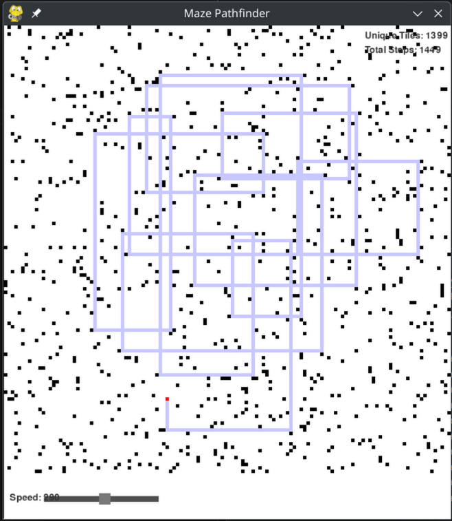
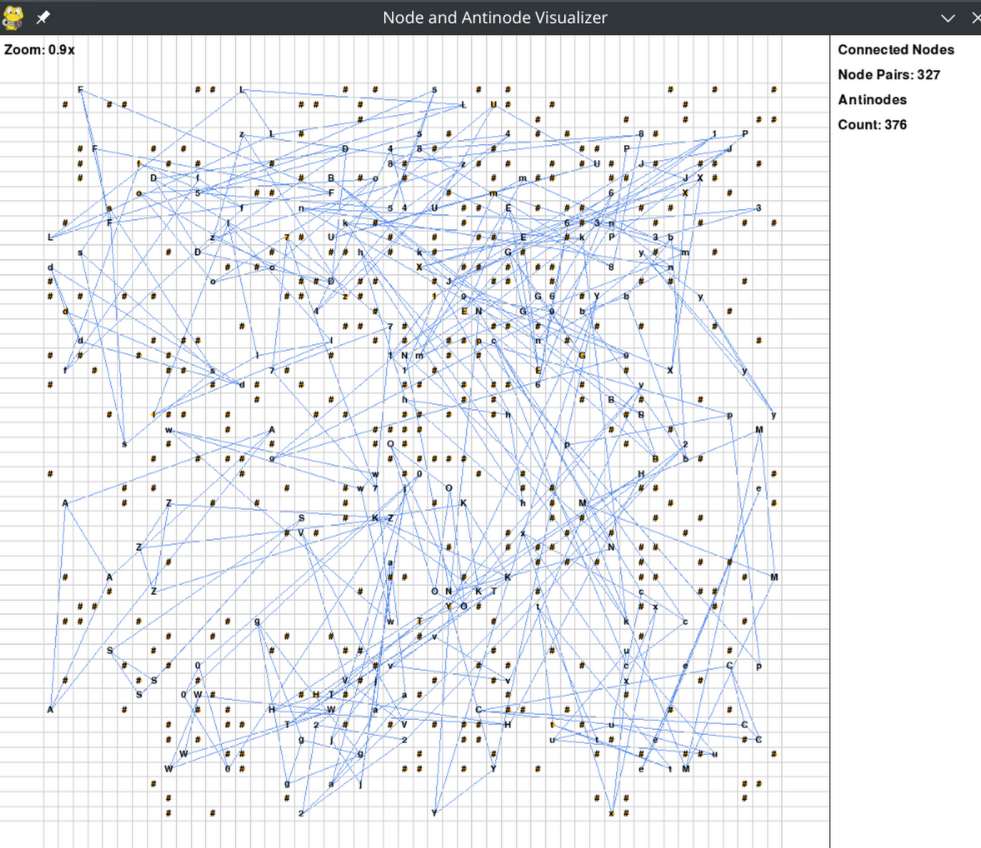

# advent-of-code-2024
My solutions to the advent of code challenges, written in various languages, and using AI.

My tactic/goal is to complete each day using any/all tools I can to solve the problems offline. This includes 

### --- Day 1: Historian Hysteria ---

### --- Day 2: Red-Nosed Reports ---

### --- Day 3: Mull It Over ---

### --- Day 4: Ceres Search ---

### --- Day 5: Print Queue ---

### --- Day 6: Guard Gallivant ---

[Guard Gallivant](./days/6)

Using Pygame, A simple path-finding maze solver for part 1, and a less-than-efficient permutations tester for part 2.
If I were to sit down and optimize this challenge, I would only test placements of walls along the walking path from part 1.

### --- Day 7: Bridge Repair ---
Process the input file, eval base2 then base3 iteration through the operators.
The most annoying part of this one was the left-to-right eval instead of obeying the order of operations.

### --- Day 8: Resonant Collinearity ---

Another grid-based challenge. My initial thought is to eval each unique node type. If there are less than 2 nodes for a given node type, ignore it. The antinodes seem simple enough. So, I'll draw lines between the nodes and tripple the cartesion points. 
example: ". . . a . a . . ." = ". # . a . a . # ." or , [(0,3),(0,5)] (len of 2) => [(0,1),(0,7)] (len of 6)

part 2 is just...irritating. I'll come back to it later (famous last words.)

### --- Day 9: ---
